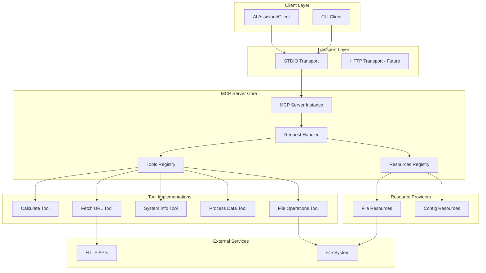
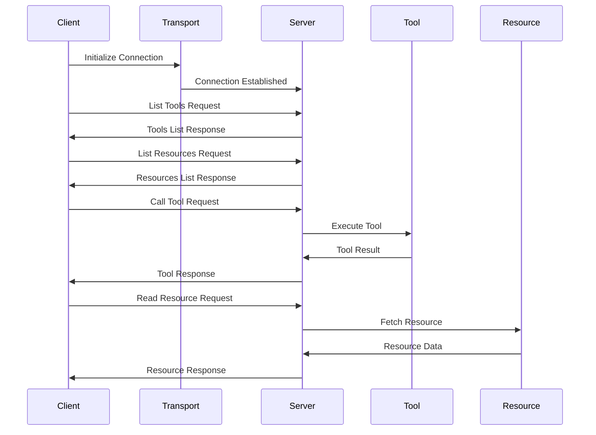

# MCP Server POC

A cutting-edge Proof of Concept (POC) implementation of a Model Context Protocol (MCP) server using Python and modern technologies. This server provides tools and resources that can be accessed by AI assistants and other MCP clients.

## 🏗️ Architecture

The MCP Server follows a modular architecture with clear separation of concerns:



### Workflow Diagram



## 🚀 Features

- **Modern Python Stack**: Built with Python 3.10+ and async/await patterns
- **Type Safety**: Full type hints with Pydantic models
- **High Performance**: Uses `uvloop` for enhanced async performance
- **Comprehensive Tools**: Multiple example tools demonstrating various capabilities
- **Resource Management**: File and configuration resource providers
- **Testing**: Complete test suite with pytest
- **Configuration**: Environment-based configuration management

## 📋 Prerequisites

- Python 3.10 or higher
- pip or poetry for package management
- Git (for cloning the repository)

## 🛠️ Installation

### Step 1: Clone the Repository

```bash
git clone <repository-url>
cd MCP-server
```

### Step 2: Create Virtual Environment

```bash
# Using venv
python3 -m venv venv
source venv/bin/activate  # On Windows: venv\Scripts\activate

# Or using conda
conda create -n mcp-server python=3.10
conda activate mcp-server
```

### Step 3: Install Dependencies

```bash
# Using pip
pip install -r requirements.txt

# For development (includes testing tools)
pip install -r requirements-dev.txt

# Or using poetry (if you prefer)
poetry install
```

### Step 4: Configure Environment

```bash
# Copy example environment file
cp .env.example .env

# Edit .env file with your settings (optional)
# nano .env
```

## 🧪 Testing

### Run All Tests

```bash
pytest
```

### Run Tests with Coverage

```bash
pytest --cov=src --cov-report=html
```

### Run Specific Test

```bash
pytest tests/test_server.py::test_calculate_tool -v
```

## 🎯 Usage

### Running the Server

#### Method 1: Direct Python Execution

```bash
python -m src.server
```

#### Method 2: Using the Script

```bash
python scripts/run_server.py
```

#### Method 3: As a Module

```bash
python -m src.server
```

### Example Client Usage

Run the example client to see the server in action:

```bash
python examples/example_client.py
```

### Available Tools

The server provides the following tools:

1. **calculate**: Perform mathematical calculations
   - Input: `{"expression": "2 + 2"}`
   - Output: Calculation result

2. **fetch_url**: Fetch content from URLs
   - Input: `{"url": "https://example.com", "method": "GET"}`
   - Output: HTTP response content

3. **get_system_info**: Get system information
   - Input: `{}`
   - Output: System details and environment variables

4. **process_data**: Process and transform data
   - Input: `{"data": "hello", "operation": "uppercase"}`
   - Operations: `reverse`, `uppercase`, `lowercase`, `count`

5. **write_file**: Write content to files
   - Input: `{"filepath": "output.txt", "content": "Hello World"}`
   - Output: Confirmation message

### Available Resources

1. **Example File**: `file://example.txt` - Example file resource
2. **Server Configuration**: `config://server-config` - Current server configuration

## 📁 Project Structure

```
MCP-server/
├── src/
│   ├── __init__.py          # Package initialization
│   ├── server.py            # Main MCP server implementation
│   └── config.py            # Configuration management
├── tests/
│   ├── __init__.py
│   └── test_server.py       # Unit tests
├── examples/
│   └── example_client.py    # Example client implementation
├── scripts/
│   └── run_server.py        # Server runner script
├── .env.example             # Example environment configuration
├── .gitignore               # Git ignore rules
├── pyproject.toml           # Project metadata and dependencies
├── pytest.ini              # Pytest configuration
├── requirements.txt         # Production dependencies
├── requirements-dev.txt     # Development dependencies
└── README.md               # This file
```

## 🔧 Configuration

The server can be configured using environment variables:

- `MCP_SERVER_NAME`: Server name (default: `mcp-server-poc`)
- `MCP_SERVER_VERSION`: Server version (default: `0.1.0`)
- `LOG_LEVEL`: Logging level (default: `INFO`)
- `ENABLE_METRICS`: Enable metrics collection (default: `true`)

## 🧩 Technology Stack

- **MCP SDK**: Official Model Context Protocol SDK for Python
- **Pydantic**: Data validation and settings management
- **httpx**: Modern async HTTP client
- **aiofiles**: Async file operations
- **uvloop**: High-performance event loop
- **pytest**: Testing framework
- **python-dotenv**: Environment variable management

## 🔍 Development

### Code Formatting

```bash
# Format code with black
black src/ tests/ examples/

# Lint with ruff
ruff check src/ tests/

# Type checking with mypy
mypy src/
```

### Adding New Tools

1. Add tool definition in `list_tools()` function
2. Implement tool logic in `call_tool()` function
3. Add tests in `tests/test_server.py`

Example:

```python
# In list_tools()
Tool(
    name="my_new_tool",
    description="Description of my tool",
    inputSchema={
        "type": "object",
        "properties": {
            "param": {"type": "string"}
        },
        "required": ["param"]
    }
)

# In call_tool()
elif name == "my_new_tool":
    param = arguments.get("param")
    # Your tool logic here
    return [TextContent(type="text", text=f"Result: {result}")]
```

## 🐛 Troubleshooting

### Common Issues

1. **Import Errors**: Ensure all dependencies are installed
   ```bash
   pip install -r requirements.txt
   ```

2. **Python Version**: Ensure Python 3.10+ is being used
   ```bash
   python --version
   ```

3. **Virtual Environment**: Make sure virtual environment is activated
   ```bash
   source venv/bin/activate
   ```

4. **Permission Errors**: Check file permissions for write operations

## 📝 License

See LICENSE file for details.

## 🤝 Contributing

1. Fork the repository
2. Create a feature branch
3. Make your changes
4. Add tests
5. Submit a pull request

## 📚 Additional Resources

- [MCP Documentation](https://modelcontextprotocol.io)
- [Python MCP SDK](https://github.com/modelcontextprotocol/python-sdk)
- [Pydantic Documentation](https://docs.pydantic.dev)

## 🎉 Next Steps

- Add more sophisticated tools (database queries, API integrations)
- Implement authentication and authorization
- Add metrics and monitoring
- Support for streaming responses
- WebSocket transport support
- Resource caching and optimization

---

**Note**: This is a POC project. For production use, consider adding:
- Proper error handling and logging
- Security measures (authentication, input validation)
- Rate limiting
- Comprehensive monitoring
- Documentation generation
- CI/CD pipelines
